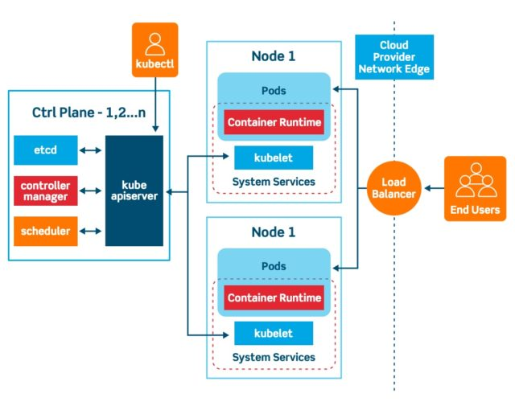
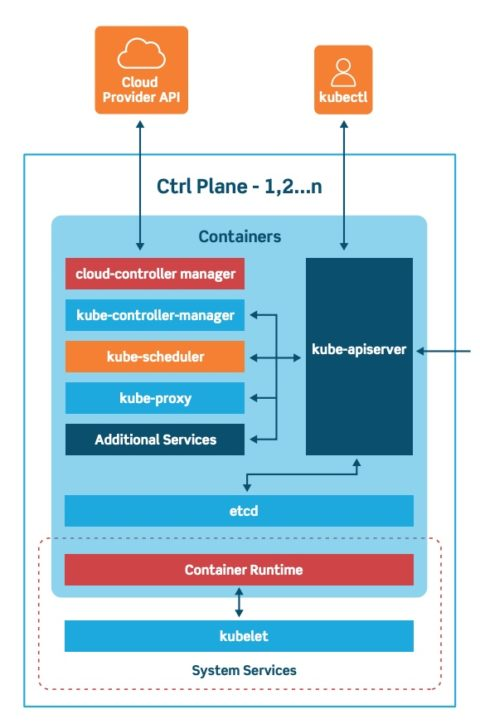
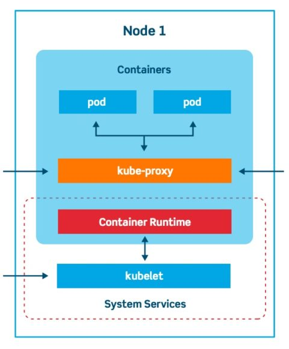
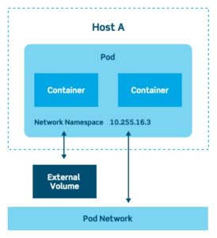

# Kuternets 基本結構認知
+ Kubernetes 是一個用於部署和管理容器的開源平台。
+ Kubernetes 是一個非常靈活和可擴展的平台。

## Kubernetes 架構和概念
+ Kubernetes 環境由控制面(control plane)(master)、用於保持集群狀態一致的分佈式存儲系統(distributed storage system)(etcd)和多個集群節點(cluster nodes)(Kubelets)組成。
  + 圖片來源：https://platform9.com/blog/kubernetes-enterprise-chapter-2-kubernetes-architecture-concepts/

  
+ Kubernetes 基本的Object有四種，分別為Pod、Service、Volume、Namespace!

### 控制面(Control Plane)概述

+ 控制面(control plane)是維護所有 Kubernetes 物件記錄的系統。

  + 控制面由三個主要組件組成：kube-apiserver、kube-controller-manager和kube-scheduler。
    + 這些組件都可以在單個主節點上運行，也可以跨多個主節點(masters)複製以實現高可用性(High Availability)。
  + API Server 針對不同類型的應用程式，提供 API 可支持生命週期排程(例如：縮放、更新等)。
  + Controller Manager 執行核心控制功能，監視叢集狀況以及驅動狀態朝向期望的狀態進行！
  + Cloud Controller Manager 整合可用區域的最佳化支援、虚擬機、存儲服務、以各式網路服務，如：DNS、路由、負載平衡，進入每一種公有雲！
  + Scheduler 負責將容器跨節點排進叢集內！

### 叢集節點(Cluster Nodes)概述

  + 節點(Nodes)是運行容器並由主節點(masters)管理的機器。
  + Kubelet 是 Kubernetes 最主要和最重要的控制器。
    + 負責驅動容器執行層，通常是 Docker。

### Pod 架構概述

  + Pod 為 Kubernetes 重要的概念之一
  + Pod 邏輯概念在於可利用多個容器與存儲卷冊打包成一個單一應用程式！
  + 通常 Pods 可用於託管垂直整合的堆疊架構，例如：WordPress 所使用的 LAMP 架構！
  + 一個 Pod 可視為一個叢集中，正在執行的一個程序！
  + Pod 的生命週期極短！當軟體需要擴展或更新版本時，Pod就會被消滅！
  + Pod 可自動平行化擴展、滾動式更新以及測試佈署！

#### Pod 類型
+ ReplicaSet: 預設相對簡單的類型。
+ Deployment: 一種通過 ReplicaSets 管理 Pod 的宣告方式！包括回滾和滾動更新機制。
+ DaemonSet: 一種確保每個節點都運行一個 Pod 實例的方法。
+ StatefulSet: 用於管理必須持久化或維護狀態的 Pod
+ Job and CronJob: 一次性或按計劃運行週期性工作。

### Service
+ Service 是 Kubernetes 配置代理以將流量轉發到一組 Pod 的方式。
+ Service 使用選擇器(或標籤)來定義哪些 Pod 使用哪些服務！
+ 動態分配使得發布新版本或向服務添加 Pod 變得非常容易。
+ Kubernetes 支援 Ingress 高層級抽象，掌管外部使用者如何存取在叢集內服務！
+ Ingress 控制器允許使用相同的負載均衡器在相同的 IP 地址下公開多個服務。

